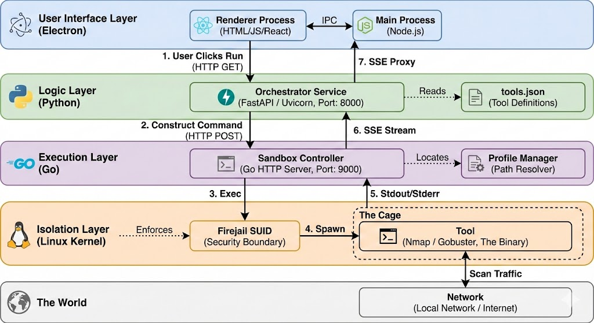
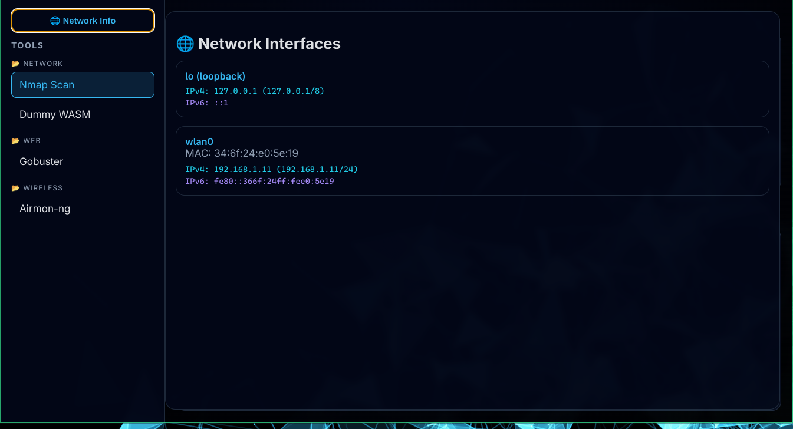
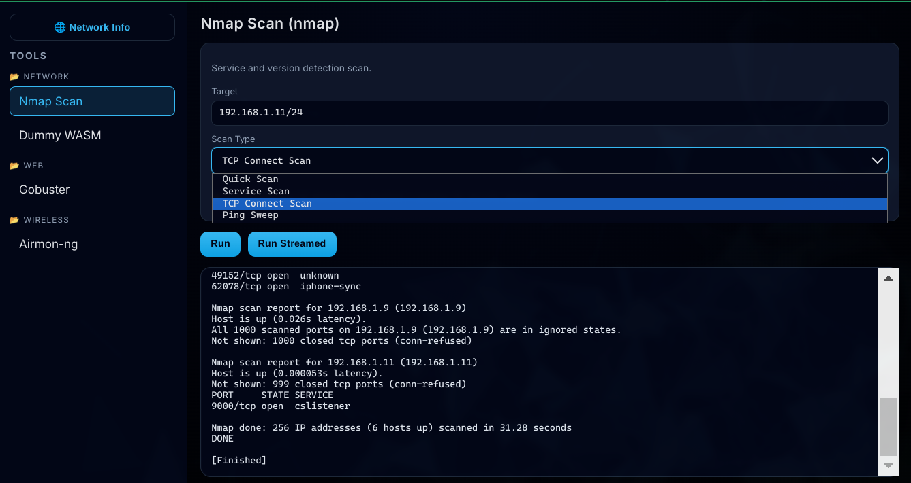

# 🛡️ Rootless

**A secure, sandboxed pentesting desktop console** (cross-platform UI; Linux sandbox enforcement today)

Rootless is a **security-first desktop application** that lets you run common pentesting tools like **Nmap** in **isolated environments**, without virtual machines, without package conflicts, and without unsafe sudo usage.

**One install → one UI → isolated tools → live output.**

---

## Security

Rootless is designed around least privilege and explicit trust boundaries. For assets, threat actors, per-layer mitigations, and known gaps (including platform parity), see **[THREAT_MODEL.md](THREAT_MODEL.md)**.

To report a vulnerability privately, see **[SECURITY.md](SECURITY.md)**.

---

## ✨ Why Rootless?

Traditional pentesting setups are painful and fragile:

* Virtual machines are heavy and slow
* Toolchains conflict with system packages
* Many tools are Linux-only
* `sudo` everywhere is dangerous
* Switching between terminals kills focus

Rootless fixes this by:

* Running tools in **OS-level sandboxes** (Firejail on **Linux today**)
* Keeping the **UI completely unprivileged**
* Granting **only the exact capabilities required**
* Streaming output live into a modern UI
* Working toward **cross-platform sandbox parity** (macOS / Windows backends are roadmap items — the UI runs cross-platform, but sandbox enforcement is Linux-only right now)

---

## 🧠 Architecture Overview

Rootless uses a **layered, least-privilege architecture**.


```
Electron UI
   ↓ IPC (safe bridge)
FastAPI Orchestrator (Python)
   ↓ HTTP + SSE
Go Sandbox Runtime
   ↓ exec
Firejail (Linux isolation)
   ↓
Pentesting Tool (Nmap, Gobuster, etc.)
   ↑
Live stdout/stderr streamed back to UI
```

### Layer Responsibilities

#### 🖥️ Electron UI

* Tool selection & presets
* Network interface visibility
* Live streaming output
* **No Node.js access**
* **No command execution**

#### 🐍 FastAPI Orchestrator

* Validates tool requests
* Maps UI presets → safe commands
* Selects sandbox profiles
* Acts as SSE proxy

#### ⚙️ Go Sandbox

* Spawns and supervises tools
* Streams stdout/stderr line-by-line
* Handles process lifecycle safely

#### 🔒 Firejail (Linux only — enforced today)

* Filesystem isolation
* Network access control
* Capability-based privileges (`net_raw`, etc.)
* No full root shells

> **Platform note:** Firejail is the only sandbox backend with enforcement in this release. On macOS and Windows, the stack runs without equivalent isolation until dedicated backends land.

---

## 🌐 Network Intelligence Panel

Rootless includes a **built-in network awareness panel**.



Features:

* Lists all network interfaces
* Shows IPv4 / IPv6 addresses
* Identifies loopback vs real interfaces
* Cross-platform via `os.networkInterfaces()`
* No shell commands, no parsing hacks

This allows users to:

* Instantly identify local subnets
* Choose correct scan targets
* Avoid accidental scans on the wrong interface

---

## 🔍 Nmap Integration (First-Class)

Nmap is not treated as a raw command runner.

### Design Principles

* ❌ No free-text flags
* ❌ No `sudo` in the UI
* ✅ Preset-driven scans
* ✅ Capability-based privileges
* ✅ Live output streaming

### Example

Instead of running:

```bash
sudo nmap -sS -sV 192.168.1.0/24
```

Users simply:

1. Select **Nmap**
2. Choose a scan type (Quick, TCP, Service, Ping)
3. Enter a target
4. Click **Run**

Rootless automatically:

* Chooses safe flags
* Selects the correct sandbox profile
* Streams output in real time


---

## 📺 Live Streaming Output

All tools stream output **live**, end-to-end.

* Line-buffered execution
* stdout and stderr handled separately
* Server-Sent Events (SSE)
* No polling
* No fake progress bars

The UI shows **exactly what the tool prints**, as it happens.

---

## 🔐 Security Model

Rootless follows **least privilege by default**.

* Renderer process cannot execute commands
* Orchestrator only accepts known tools
* Sandbox enforces filesystem isolation
* Network access is explicit
* Raw sockets only when required
* One-way trust flow:

```
UI → Orchestrator → Sandbox → Tool
```

A compromised UI **does not** equal system compromise.

---

## 🧩 Tool Support

### First-class today

* ✅ **Nmap** — preset-based scans, dedicated Firejail profile, live SSE streaming
* ✅ Network interface discovery (cross-platform, read-only)

### Catalog / roadmap (not first-class yet)

* 🔜 Gobuster, wireless tooling, WASM-based tools — entries or stubs exist; they do not yet match the Nmap integration bar (preset schema + hardened profile + end-to-end UX)

---

## 🚧 Project Status

Rootless is **actively developed**.

Current focus:

* Hardening sandbox profiles
* Improving Nmap UX
* Expanding tool abstractions
* Preparing cross-platform backends (macOS / Windows)

---

## 🛣️ Short-Term Roadmap

* Interface → auto-fill scan target
* Tool-specific permission warnings
* Saved scan presets
* Tool result export
* App packaging (AppImage / dmg / exe)

---

## 🤝 Contributing

Contributions are welcome — especially tool integrations that follow the preset-only, sandboxed pattern. Read **[CONTRIBUTING.md](CONTRIBUTING.md)** for project layout, local dev setup, the step-by-step tool integration checklist, and PR review rules (sandbox profile changes require explicit security review).

---

## 📜 License

[Apache License 2.0](LICENSE) — Copyright 2026 Karan Desai

